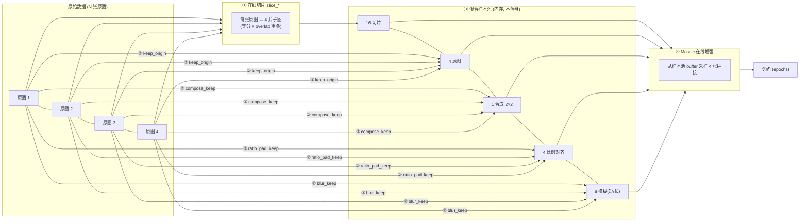

# 项目说明：Ultralytics 在线数据增强与修补续训扩展

> 在原生 Ultralytics（YOLO26）基础上，不改动原有训练功能，通过**索引空间扩展**把「在线切片 / 在线合成 / 在线比例调整 / 在线运动模糊」全部搬进内存数据管线，与 Mosaic 无缝衔接；并集成「训练提前终止后的 checkpoint 修补续训」。所有中间产物默认不落盘，除非显式指定保存目录。

---

## 一、整体流程

4 张原图 → 在线切片(16 切片) + 保留原图(4) + 在线合成(1 张 2×2 大图) + 在线比例调整(4) + 在线运动模糊(8，短/长各 2) = **33 张混合样本池**，一起进入 Mosaic 采样，mosaic 从中取 4 张拼成 1280×1280 训练。



样本数公式（开启全部模块）：

```
每张原图展开 n_per 个样本 = 4 切片 + 1 原图 + 1 比例 + 2 模糊 = 8
样本池总数 = 8 × N + N/4(合成)     （N=4 时 = 33）
```

训练开始时，日志会打印实际参与训练的样本数（如 `140 training samples from 28 images`），用于确认切片/原图/合成/比例/模糊确实参与了训练。

---

## 二、核心设计思路（从 0 构建）

### 2.1 为什么"在线"而不是"离线"

项目最早是**离线工具**（`pytools/` 下的切片/合成/比例/模糊脚本），离线方案的痛点：

- 每个增强都要落盘大量图片 + 标签文件，磁盘爆炸、IO 慢；
- 参数改一下要重跑整个预处理流程；
- 增强后的图片被"固化"，无法与 Mosaic 这类训练期增强组合。

**在线化思路**：把每个增强做成一个"内存函数"，在数据管线取样本时即时生成，参数在 `train.py` 里实时可调，生成结果直接进 Mosaic 的采样 buffer，全程不碰磁盘。中间产物要检查时，通过各模块的 `*_save_dir` 显式落盘。

### 2.2 核心难点：如何让"虚拟样本"进入 Mosaic

Ultralytics 的 Mosaic 是从 `dataset.buffer` 里随机采样多张图拼接的。切片/合成/比例/模糊产生的图都是"原图上派生的虚拟样本"，要让它们被 Mosaic 采到，关键是**索引空间扩展**：

- 数据集 `__getitem__` 的索引空间从 `N`（原图数）扩展为 `N × n_per + N/4`；
- `get_image_and_label` 里用 `index // n_per` 还原到哪张原图、`index % n_per` 决定取哪个子样本（0-3=切片、4=原图、5=比例、6/7=模糊短/长，超出部分=合成）；
- 每个子样本都按原图路径即时加载原分辨率图 → 应用对应变换 → 把 `buffer.append(index)` 用**扩展后的索引**维护，Mosaic 就能采到所有虚拟样本。

```
index ──÷n_per──→ 原图 i
      └──mod n_per──→ 子样本类型: 0~3 切片 / 4 原图 / 5 比例 / 6,7 模糊 / ≥8N 合成
```

### 2.3 标签始终与像素对齐

每个在线变换都同步换算 bbox 坐标，保证"图像像素 ↔ 标签框"一一对应：

| 变换 | 坐标处理 |
|---|---|
| 切片 | 裁剪窗口偏移量叠加到框坐标，越界部分裁剪 |
| 合成 2×2 | 各象限平移量叠加，全局坐标重算 |
| 比例调整 | 加边框的偏移量叠加 |
| 运动模糊 | 目标不动，**标签原样不变** |

切片在**原分辨率**图像上进行（而非训练缩图），这样小目标在子图缩放到训练尺寸（1280）时被真正放大——这是航拍小目标提升的关键。

### 2.4 可验证、可关闭、不改变原生功能

- **可关闭**：每个模块都有独立开关（`slice_prob=0` / `compose_keep=False` / `ratio_pad_keep=False` / `blur_keep=False`），全关时完全等价原生 Ultralytics；
- **可验证**：中间产物默认不保存；需要检查时指定 `*_save_dir`，保存**带标注框**的 JPG，按 `*_save_max` 限张数、按 `(图像, 切片/类型)` 去重（跨 epoch 每张只存一次）；
- **不越界**：所有改动集中在 `data/augment.py`、`data/base.py`、`engine/trainer.py`、`cfg/`，不触碰模型结构、损失函数、评估逻辑。

### 2.5 参数命名规范

早期参数全部叫 `slice_xxx`，后来规范为**见名知义 + 中文注释**：

- 只有「切片」相关才用 `slice_` 前缀（`slice_overlap_ratio`、`slice_all_tiles`…）；
- 「在线合成」用 `compose_*`、「在线比例调整」用 `ratio_pad_*`、「在线运动模糊」用 `blur_*`、「Mosaic」用 `mosaic_*`、「续训延长」用 `resume_extend_epochs`；
- 每个参数在 `train.py` 里带中文注释说明作用、取值范围、默认值。

---

## 三、模块详解

### 3.1 在线切片（SAHI 在线化）

- **实现**：`ultralytics/data/augment.py` 的 `OnlineSlice` 类（`slice_at`），离线工具是 `pytools/sahi_equal_division_slice_dataset_auto_improved.py`。
- **切法**：原图等分 4 片（2×2 网格），`slice_overlap_ratio` 控制相邻重叠；例：4000×3000 + 重叠 0.2 → 切片 2400×1800。
- **目标保留判定**（4 个开关，都是 AND/OR 组合的双重面积过滤）：
  | 参数 | 作用 |
  |---|---|
  | `slice_min_tile_area_ratio` | 切片块面积下界，过小的切片直接丢弃 |
  | `slice_min_box_retain_ratio` | 目标在片内可见面积 / 原框面积 < 该值则丢弃该目标 |
  | `slice_center_constraint` | 目标唯一归属：只分配给中心所在切片，防被切两半重复 |
  | `slice_min_center_retain_ratio` | 中心不在本片时，片内可见占比 ≥ 该值仍保留；1.0=严格只留中心片 |
  | `slice_full_box_only` | 目标必须完整落在片内才保留，被边界切开即过滤（优先于中心约束） |
- **背景切片控制**：`slice_background_ratio` = 背景切片数 / 正切片数；-1 全部背景保留，0 不要背景。
- **发射策略**：`slice_all_tiles=True` 时每张原图的 4 片子图**全部参与训练**；`slice_keep_origin=True` 时额外保留 1 张未切片原图（提供全图上下文）。
- **切片/整图混排**：`slice_mix_ratio`（默认 1.0）控制 batch 内走切片的样本比例，<1.0 时按概率混入未切片整图，缓解小数据集过拟合到切片分布。

### 3.2 在线合成（compose）

- **实现**：`base.py` 的 `_compose_at`，离线工具是 `pytools/compose_slice_dataset_auto_improved.py`。
- **作用**：每 4 张原图拼成 1 张 2×2 大图，让模型看到更大范围的多目标上下文（目标仍完整保留、坐标平移重算）。
- **开关**：`compose_keep=True`（加入样本池）+ `compose_save=True`（保存用于检查，需指定 `compose_save_dir`）。

### 3.3 在线比例调整（ratio_pad）

- **实现**：`base.py` 的 `_ratio_at` + `_ratio_pad_params`，离线工具是 `pytools/change_image_resolution_slice_dataset_auto_improved.py`。
- **作用**：给图加边框（不缩放、不裁剪）统一宽高比，避免训练时被拉伸变形。`ratio_pad_color` 可选 black/gray/white。
- **目标比例**：`ratio_pad_target="auto"` 时，4:3 ↔ 16:9 双向对齐，其他比例缩放到离它最近的 4:3 或 16:9；也可指定具体比例。

### 3.4 在线运动模糊（blur）

- **实现**：`base.py` 的 `_blur_at` + `_apply_motion_blur`（运动模糊核 + 可选高斯失焦），离线工具是 `pytools/motion_blur.py`。
- **作用**：模拟无人机运动失焦。每张原图生成 **2 张**模糊副本——短模糊（轻度、无失焦）与长模糊（重度、可选失焦），标签不变。
- **参数**：`blur_short_len_min/max`（短模糊像素长度）、`blur_long_len_min/max`（长模糊长度）、`blur_long_defocus_sigma`（失焦强度，0=不加）。

### 3.5 Mosaic 在线增强与保存

- 原生 Mosaic 保留（`mosaic=1.0`），样本池 buffer 被上述虚拟样本填充后，Mosaic 从中采样 4 张拼接。
- **保存开关**：`mosaic_save_dir`（指定才保存，用于验证 mosaic 是否正常启用）、`mosaic_save_max`、`mosaic_save_exist_ok`。

### 3.6 修补续训 vs 无缝续训（resume_extend_epochs）

#### 3.6.1 checkpoint 里到底存了什么

一个 Ultralytics `last.pt` 不只是模型权重，它打包了训练的全部"运行状态"：

| 组件 | 作用 | strip 前 | strip 后 |
|---|---|---|---|
| **model 权重** | 网络全部参数 | ✅ | ✅ 保留 |
| **optimizer 状态** | SGD 动量 buffer / Adam 的 `exp_avg`、`exp_avg_sq` | ✅ | ❌ 丢弃 |
| **EMA 权重** | 指数移动平均的平滑模型副本（验证/选 best 用它） | ✅ | ❌ 丢弃 |
| **GradScaler** | AMP 梯度缩放因子 | ✅ | ❌ 丢弃 |
| **epoch** | 当前轮索引 | 真实值 | 置为 `-1`（标记已完成） |
| **train_args** | 训练配置 | ✅ | ✅ 保留 |

`strip_optimizer`（优化器剥离）是 Ultralytics 在**训练自然结束**时做的最终化：删掉 optimizer/EMA/scaler 以缩小体积（几百 MB → 几十 MB），方便部署与分享。

#### 3.6.2 训练结束路径决定 last.pt 状态

关键机制：`trainer.py` 的 `final_eval()`（训练循环 break 后无条件执行）会对 `last.pt` 调用 `strip_optimizer`。因此——

| 训练如何结束 | last.pt 状态 | 续训方式 |
|---|---|---|
| 跑满 epochs | strip 过（无 optimizer、epoch=-1） | **修补续训** |
| patience 早停触发 | strip 过（无 optimizer、epoch=-1） | **修补续训** |
| 进程被硬中断（Ctrl+C / OOM / 崩溃） | 保留完整 optimizer、epoch=真实停点 | **无缝续训** |

**结论**：只有进程级硬中断（`final_eval` 没机会运行）才能留下含 optimizer 的 `last.pt`——那才是真正意义的"断点续传"。正常结束（含早停）的 `last.pt` 注定是 strip 过的完成品，原版 resume 会拒绝（"training to X epochs is finished"），且改命令行 `epochs` 也无效（resume 时 `check_resume` 用 ckpt 存档配置重建 args）。这正是"修补续训"存在的理由。

#### 3.6.3 两种续训方式的差异

| 维度 | 无缝续训（含 optimizer） | 修补续训（无 optimizer） |
|---|---|---|
| model 权重 | ✅ 保留 | ✅ 保留 |
| optimizer 动量 | ✅ 接续，曲线连续 | ❌ 重新初始化，需重新预热 |
| EMA 平滑副本 | ✅ 接续 | ❌ 从当前权重重新累积 |
| GradScaler (AMP) | ✅ 接续 | ❌ 重建 |
| LR schedule | 从停点继续 | 按新总轮数重建 |
| epoch 计数 | 从停点+1 继续 | 从停点+1 继续 |
| 本质 | "训练没停过" | "用上次权重重新优化" |

修补续训比从 `yolo26n.pt` 从头训快很多（保留了训练成果），但不是无缝级别。

#### 3.6.4 如何判断一个 ckpt 能否无缝续训

```python
import torch
ck = torch.load('last.pt', map_location='cpu', weights_only=False)
print('可无缝续训:', ck.get('optimizer') is not None and ck.get('epoch', -1) >= 0)
```

或者用 `model.train(resume=True)`（布尔值）——框架会自动检查 optimizer，没有则降级为新训练。注意：resume 传**路径字符串**会绕过这层检查，直接走到断言（这正是集成前用户踩的坑）。

#### 3.6.5 集成实现与参数设置

**集成**：`trainer.py` 的 `resume_training` 内嵌自动修补块——设置 `resume_extend_epochs=N` 时，自动检测已完成轮数（中断场景=ckpt.epoch+1；已完成场景=从 train_args 读原 epochs），校验 `N > 已完成轮数`（否则 ValueError），把 ckpt 的 `epoch` 改回 `finished-1`、`epochs`/`patience` 修补为新值、重建 LR schedule，从停点+1 续训到 N。逻辑复用离线工具 `pytools/fix_checkpoint_for_extension.py`。

**`resume_extend_epochs` 怎么设**（硬约束 + 建议）：

| 续训目的 | resume_extend_epochs | patience 建议 |
|---|---|---|
| 纯验证续训是否工作 | 已完成 + 小增量（如 15） | 不变 |
| 跑满 epochs，模型还在涨 | 给足大目标（如 200/400） | 保持/适当调大 |
| 早停后想突破平台期 | 给足大目标（如 200/400） | **调大**（如 100+） |

- **硬约束**：`resume_extend_epochs` 必须 > 已完成轮数（`extend ≤ finished` 直接 ValueError）；
- **为什么建议设足**：修补续训时动量清零需预热，且 LR schedule 按新总轮数重建（如 cosine 重新展开），给足轮数才有机会突破平台；只续几轮动量没预热就停，**可能反而不如原模型**；
- **patience 联动**：早停靠 `patience` 触发，若续训后仍用原值且模型已收敛，会被立刻再次早停，大目标跑不到——所以"早停后续训"要同步调大 patience（或改用 `time` 上限）。

**集成时踩过的坑**（详见 4.3）：
1. `epoch=-1`（已完成）场景：修补块先 `ckpt["epoch"]=finished-1` 再重算 `start_epoch`，否则 `start_epoch=0` 触发断言；
2. `check_resume` 用 ckpt 存档配置重建 `self.args` 且白名单不覆盖 `resume_extend_epochs` → 用户传的值被丢弃 → 需把该键加入 `check_resume` 白名单；
3. Muon 优化器 `u.view()` 非连续张量报错 → 改 `u.reshape()`。

---

## 四、遇到的问题与解决

### 4.1 在线切片相关

| 问题 | 现象 | 解决 |
|---|---|---|
| 切片数量对不上 | `slice_background_ratio=1` 时保存数从 106 暴涨到 411 | 背景计数与 `emit_all` 相互作用、每轮重复保存 → 加 `_saved_keys` 按 `(图像, 切片)` 去重，跨 epoch 每张只存一次 |
| mosaic buffer 空采样崩溃 | `IndexError: list index out of range` at `random.choices(list(self.dataset.buffer))` | 预计算 + `len` 不恒定导致 buffer 状态异常；评估后选择"方式A 保持现状"（接受该约束） |
| 目标被切两半重复出现 | 同一目标出现在重叠区多个切片 | 引入 `slice_center_constraint` 目标唯一归属；配合 `full_box_only` / `min_center_retain_ratio` 覆盖"目标全保存除非正好切到"的需求 |
| 训练日志样本数无法确认 | 无法判断切片是否参与训练 | 训练开始前打印 `Online slicing: {n_total} training samples from {n_origin} images (...)` |
| 切片保存目录已存在 | 二次运行报 FileExistsError | 提供 `slice_save_exist_ok=True` |

### 4.2 在线合成 / 比例 / 模糊

| 问题 | 解决 |
|---|---|
| `compose_keep=True` 时合成图没保存 | 拆出独立的 `compose_save` + `compose_save_dir`，与 slice 保存解耦 |
| 比例调整目标不确定 | `ratio_pad_target="auto"`：4:3↔16:9 双向 + 其他比例转最近 |
| 运动模糊每张生成几张合适 | 离线工具改造为每张 2 张（短+长），在线 `blur_keep` 保持每图+2 |
| 中间产物默认落盘 | 明确"所有中间图默认不保存，除非指定 `*_save_dir`" |

### 4.3 修补续训

| 问题 | 现象 | 解决 |
|---|---|---|
| Muon 优化器崩溃 | `RuntimeError: view size is not compatible ... Use .reshape()` | `ultralytics/optim/muon.py`：`u.view(len(u), -1)` → `u.reshape(...)`（非连续张量不能用 view） |
| resume 已完成 ckpt 被拒 | `AssertionError: ... training to 10 epochs is finished` | 修补块内 `epoch<0` 时先 `ckpt["epoch"]=finished-1` 再重算 `start_epoch` |
| 用户参数被 ckpt 配置覆盖 | 设了 `resume_extend_epochs=15` 仍报错 | `check_resume` 用 ckpt 存档配置重建 `self.args` 且白名单不覆盖该键 → 把 `resume_extend_epochs` 加入 `check_resume` 白名单 |
| 测试误用旧版 ultralytics | 从子目录跑脚本 import 到 site-packages 旧版 | 设 `PYTHONPATH=项目根` 强制用本地包 |

### 4.4 其他工程坑

- **参数命名**：早期全 `slice_*` 前缀、无注释 → 改为模块化前缀 + 中文注释（用户偏好：见名知义）。
- **能力边界**：每新增一个在线模块前都先做"可行性分析"（内存、坐标同步、与 mosaic 兼容性），确认后再实现。

---

## 五、快速开始

```python
model = YOLO('ultralytics/cfg/models/26/yolo26n.yaml')
model.load('yolo26n.pt')
model.train(
    data='data.yaml', imgsz=1280, epochs=10, batch=4, workers=0,
    # ---- Mosaic ----
    mosaic=1.0,
    # ---- 在线切片 ----
    slice_prob=1.0, slice_overlap_ratio=0.2, slice_all_tiles=True,
    slice_keep_origin=True, slice_mix_ratio=1.0,
    slice_min_tile_area_ratio=0.005, slice_min_box_retain_ratio=0.4,
    slice_center_constraint=True, slice_min_center_retain_ratio=0.6, slice_full_box_only=False,
    # ---- 在线合成 ----
    compose_keep=True, compose_save=True, compose_save_dir=r'...',
    # ---- 在线比例 ----
    ratio_pad_keep=True, ratio_pad_target='auto', ratio_pad_color='gray',
    # ---- 在线模糊 ----
    blur_keep=True,
    # ---- 检查用保存（默认不落盘） ----
    slice_save_annotated=True, slice_save_max=0, slice_save_dir=r'...',
    # ---- 修补续训 ----
    resume='runs/exp-2-2/weights/last.pt', resume_extend_epochs=15,
)
```

---

## 六、文件结构

| 文件 | 作用 |
|---|---|
| `pytools/sahi_equal_division_slice_dataset_auto_improved.py` | 离线切片工具（在线切片的设计来源） |
| `pytools/compose_slice_dataset_auto_improved.py` | 离线合成工具 |
| `pytools/change_image_resolution_slice_dataset_auto_improved.py` | 离线比例调整工具 |
| `pytools/motion_blur.py` | 离线运动模糊工具 |
| `pytools/fix_checkpoint_for_extension.py` | 续训修补 CLI（`resume_extend` 的设计来源） |
| `ultralytics/data/augment.py` | `OnlineSlice` 类、Mosaic 保存 |
| `ultralytics/data/base.py` | 索引空间扩展、`_ratio_at` / `_blur_at` / `_compose_at`、样本数打印 |
| `ultralytics/engine/trainer.py` | `resume_training` 修补块、`check_resume` 白名单 |
| `ultralytics/cfg/default.yaml` / `__init__.py` | 全部新增参数注册 |
| `train.py` | 训练入口，集中配置全部在线增强 + 续训参数 |
