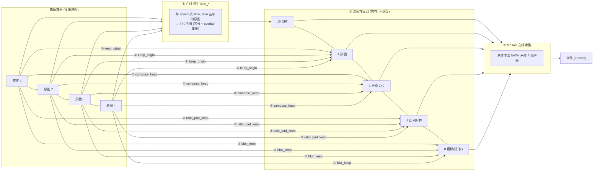

# 项目说明：Ultralytics 在线数据增强与修补续训扩展

> 在原生 Ultralytics（YOLO26）基础上，**不改动原有训练功能**，通过「索引空间扩展」把「在线切片 / 在线合成 / 在线比例调整 / 在线运动模糊」全部搬进内存数据管线，与 Mosaic 无缝衔接；并集成「训练提前终止后的 checkpoint 修补续训」。所有中间产物默认不落盘，除非显式指定保存目录。

---

## 一、整体流程

4 张原图 → 在线切片（16 切片，由 `slice_ratio` 按 epoch 决定哪些原图走切片）+ 保留原图（4）+ 在线合成（1 张 2×2 大图）+ 在线比例调整（4）+ 在线运动模糊（8，短/长各 2）= **33 张混合样本池**，一起进入 Mosaic 采样，mosaic 从中取 4 张拼成训练尺寸。



样本池采用**区段式布局**：基础区段（切片）+ 4 个独立区段（原图/比例/模糊/合成），每个区段只受自己的开关控制，互不影响：

```text
[0, 4N)                切片     slice_prob / slice_all_tiles（slice_ratio 决定哪些原图进本区段）
[4N, 5N)               原图     slice_keep_origin（独立开关，不再耦合切片）
[5N, 6N)               比例     ratio_pad_keep
[6N, 8N)               模糊     blur_keep（每图短/长 2 张）
[8N, 8N+ceil(N/4))     合成     compose_keep
全开总数 = 8 × N + ceil(N/4)    （N=4 时 = 33）
```

训练开始时，日志会打印实际参与训练的样本数（如 `Online augment: 231 training samples from 28 images (4 slices + 1 origin + 1 ratio + 2 blur + N/4 compose per image)`），用于确认切片/原图/合成/比例/模糊确实参与了训练。

---

## 二、核心设计思路（从 0 构建）

### 2.1 为什么"在线"而不是"离线"

项目最早是**离线工具**（`pytools/` 下的切片/合成/比例/模糊脚本），离线方案的痛点：

- 每个增强都要落盘大量图片 + 标签文件，磁盘爆炸、IO 慢；
- 参数改一下要重跑整个预处理流程；
- 增强后的图片被"固化"，无法与 Mosaic 这类训练期增强组合。

**在线化思路**：把每个增强做成一个"内存函数"，在数据管线取样本时即时生成，参数在 `train.py` 里实时可调，生成结果直接进 Mosaic 的采样 buffer，全程不碰磁盘。中间产物要检查时，通过各模块的 `*_save_dir` 显式落盘。

### 2.2 核心难点：如何让"虚拟样本"进入 Mosaic

Ultralytics 的 Mosaic 是从 `dataset.buffer` 里随机采样多张图拼接的。切片/合成/比例/模糊产生的图都是"原图上派生的虚拟样本"，要让它们被 Mosaic 采到，关键是**索引空间扩展**：

- 数据集 `__getitem__` 的索引空间从 `N`（原图数）扩展为 `N × n_per + 各独立区段`；
- `get_image_and_label` 里按区段边界路由：先判 compose / blur / ratio / origin 区段，落在基础区段 `[0, 4N)` 时用 `index // n_per` 还原到哪张原图、`index % n_per` 决定取哪个 tile（0-3）；
- 每个子样本都按原图路径即时加载原分辨率图 → 应用对应变换 → `buffer.append(index)` 用**扩展后的索引**维护，Mosaic 就能采到所有虚拟样本。

### 2.3 样本池长度恒定（硬约束）+ buffer 记账

`__len__` 必须恒定（4N 或全开 8N+ceil(N/4)）：DataLoader 的 len 在构建时确定一次，预计算 + len 不恒定会导致 Mosaic buffer 记账错乱、epoch 内样本数漂移（早期踩过 `IndexError: list index out of range`）。因此所有在线模块都遵循：

- **位置保留、内容替换**：每个样本位永远产出"像素与 bbox 匹配"的样本；
- **方案 A（被拒背景片退回原图）** 正是这一原则的体现——不丢样本位，换成信息更丰富的原图；
- 三个比例参数（`compose_ratio` / `ratio_pad_ratio` / `blur_ratio`）的"未选中位退回整图"同样遵循此原则。

**buffer 记账有两套路径，必须互斥**（修过的坑）：

| 路径 | 索引 | 激活条件 |
|---|---|---|
| `load_image` 自管（纯原版） | 原图索引 `i` | 无切片 **且** 无任何扩展段开启 |
| `get_image_and_label` 统一记账（本项目） | 扩展索引 `index` | 切片开启 **或** 任一扩展段（keep_origin/ratio/blur/compose）开启 |

- 若 `load_image` 在扩展池开启时仍自管 buffer，会 pop 到扩展索引 → `ims[j]` 越界（`IndexError: list assignment index out of range`）；
- 若 `get_image_and_label` 在"切片关 + 扩展段开"时漏记账，base 段样本不进 buffer → Mosaic `random.choices` 空列表崩（`IndexError: list index out of range`）；
- 两处条件互补（`slice_t is not None or _extended_pool_on()`），纯原版时 `load_image` 恢复原生行为，全关完全等价原生 Ultralytics。

### 2.4 标签始终与像素对齐

每个在线变换都同步换算 bbox 坐标，保证"图像像素 ↔ 标签框"一一对应：

| 变换 | 坐标处理 |
|---|---|
| 切片 | 裁剪窗口偏移量叠加到框坐标，越界部分裁剪 |
| 合成 2×2 | 各象限平移量叠加，全局坐标重算 |
| 比例调整 | 加边框的偏移量叠加 |
| 运动模糊 | 目标不动，**标签原样不变** |

切片在**原分辨率**图像上进行（而非训练缩图），这样小目标在子图缩放到训练尺寸（1280）时被真正放大——这是航拍小目标提升的关键。

### 2.5 可验证、可关闭、不改变原生功能

- **可关闭**：每个模块都有**真正独立的开关**（`slice_prob` / `slice_keep_origin` / `compose_keep` / `ratio_pad_keep` / `blur_keep` 互不影响——compose/ratio/blur/keep_origin 不再被 `slice_prob=0` 强制关闭，只有 rect/obb 模式由公共前置统一禁用全部在线增强），全关时完全等价原生 Ultralytics；
- **可验证**：中间产物默认不保存；需要检查时指定 `*_save_dir`，保存**带标注框**的 JPG，按 `*_save_max` 限张数、按 `(图像, 切片/类型)` 去重（跨 epoch 每张只存一次）；
- **不越界**：所有改动集中在 `data/augment.py`、`data/base.py`、`engine/trainer.py`、`cfg/`，不触碰模型结构、损失函数、评估逻辑。

### 2.6 独立开关 + epoch 级精确比例

四个比例参数与 `slice_ratio` 完全同构，全部由 `set_epoch(epoch)` 主进程重建掩码（worker 经 fork 继承，无 per-worker 漂移）：

| 参数 | 粒度 | 语义 |
|---|---|---|
| `slice_ratio` | 原图级 | 每 epoch 精确选 `round(x×N)` 张原图走切片 |
| `compose_ratio` | 组级 | 每 epoch 选 `round(x×⌈N/4⌉)` 组合成，未选中组退回组内第 1 张原图 |
| `ratio_pad_ratio` | 原图级 | 每 epoch 选 `round(x×N)` 张做比例调整，未选中直接整图 |
| `blur_ratio` | 原图级 | 每 epoch 选 `round(x×N)` 张做模糊，短+长同命运，未选中整图×2 |

- 未选中位全部**位置保留、内容替换**，`len` 恒定；
- `ratio >= 1.0` 或开关关闭 → 掩码 None（全量/关闭，零开销，完全向后兼容）。

---

## 三、模块详解

### 3.1 在线切片（SAHI 在线化）

- **实现**：`ultralytics/data/augment.py` 的 `OnlineSlice` 类（`slice_at` / `__call__`），离线工具是 `pytools/sahi_equal_division_slice_dataset_auto_improved.py`。
- **切法**：原图等分 4 片（2×2 网格），`slice_overlap_ratio` 控制相邻重叠；例：4000×3000 + 重叠 0.2 → 切片 2400×1800。
- **发射策略**：`slice_all_tiles=True` 时每张原图的 4 片子图**全部参与训练**（基础区段固定 4N）；`False` 时每图随机取 1 片。

#### 3.1.1 切片/整图混排：slice_ratio（epoch 级原图级精确比例）

 **`slice_ratio`**：每个 epoch 开始时由 `trainer.py` 调用 `dataset.set_epoch(epoch)` 重建掩码，**精确选 `round(x × N)` 张原图**走在线切片，其余原图整图进池。

- **原图级决策**：`emit_all` 下同一原图的 4 片同生共死（要么全切片，要么全整图）；
- **每 epoch 重新随机**：掩码在主进程生成一次，DataLoader worker 通过 fork 继承 → 无 per-worker 漂移、比例精确；
- `slice_ratio=1.0`（默认）→ 掩码 None = 纯切片（旧行为）；`0` → 全整图（等效关闭切片）；
- `len` 恒为 4N，不受影响。

#### 3.1.2 目标保留判定（双重面积过滤）

| 参数 | 作用 |
|---|---|
| `slice_min_tile_area_ratio` | 切片块面积下界，过小的切片直接丢弃 |
| `slice_min_box_retain_ratio` | 目标在片内可见面积 / 原框面积 < 该值则丢弃该目标 |
| `slice_center_constraint` | 目标唯一归属：只分配给中心所在切片，防被切两半重复 |
| `slice_min_center_retain_ratio` | 中心不在本片时，片内可见占比 ≥ 该值仍保留；1.0=严格只留中心片 |
| `slice_full_box_only` | 目标必须完整落在片内才保留，被边界切开即过滤（优先于中心约束） |

#### 3.1.3 背景切片控制
- `slice_background_ratio` = 背景切片数 / 正切片数；-1 全部背景保留，0 不要背景；配额跨原图累计（`bg_count < pos_count × ratio`）。
- `emit_all` 下配额不足的背景片**不再裁成空片占位**，而是**退回整张原图**（带全量 bbox）。原因：空片与背景片在训练视角等价（同一块裁剪区域 + 空标签），负样本占比由切片几何锁死（目标稀疏场景可达 ~67%），`background_ratio` 调不动它；退回原图后负样本占比由 `background_ratio` 真实控制（实测 67% → 12.5%），且退回原图 = 隐式过采样正样本。

#### 3.1.4 保留原图（slice_keep_origin，独立开关）

额外把 1 张未切片原图放进样本池（提供全图上下文）。它已从切片机制中拆出——不再影响 `n_per`，而是独立的 `[4N, 5N)` 区段（`_origin_at`），开关不受 `slice_prob=0` 影响；但切片关闭时由 `_keep_origin_on()` 自动抑制（原图本来就在池里，再保留即重复）。

> 注意：被拒背景片位会退回原图，`slice_keep_origin` 的整图功能被覆盖（每图可能出现约 3.7 份原图冗余）——**建议设 `slice_keep_origin=False`**，仅当"目标密集、4 片几乎全有目标"时保留它提供唯一整图上下文。

### 3.2 在线合成（compose）

- **实现**：`base.py` 的 `_compose_at`，离线工具是 `pytools/compose_slice_dataset_auto_improved.py`。
- **作用**：每 4 张原图拼成 1 张 2×2 大图，让模型看到更大范围的多目标上下文（目标仍完整保留、坐标平移重算）。
- **开关**：`compose_keep=True`（独立开关，不依赖切片/keep_origin）+ `compose_save=True`（保存用于检查，需指定 `compose_save_dir`，或回退 `slice_save_dir/compose/`）。
- **比例**：`compose_ratio`（组级，默认 1.0）——每 epoch 选 `round(x×⌈N/4⌉)` 组合成，未选中组退回组内第 1 张原图（len 恒定）。
- **拼后降采样（`compose_max_side`）**：0=自动=2×imgsz（默认开启）；>0=手动指定最长边上限（如 2560）。4 张 4000×3000 原图拼出 8000×6000（≈144MB/张），在进 Mosaic 前缩到最长边 2560（≈18MB，约 **8 倍内存下降**）；bbox/segment/keypoint 均为**归一化坐标**，只缩放像素不影响标签。这是缓解在线增强 worker 内存峰值（第 2 epoch 卡死）的关键手段，合成图保留的是"多目标上下文"而非细节，降采样零语义损失。

### 3.3 在线比例调整（ratio_pad）

- **实现**：`base.py` 的 `_ratio_at` + `_ratio_pad_params`，离线工具是 `pytools/change_image_resolution_slice_dataset_auto_improved.py`。
- **作用**：给图加边框（不缩放、不裁剪）统一宽高比，避免训练时被拉伸变形。`ratio_pad_color` 可选 black/gray/white。
- **目标比例**：`ratio_pad_target="auto"` 时，4:3 ↔ 16:9 双向对齐，其他比例缩放到离它最近的 4:3 或 16:9；也可指定具体比例。
- **比例**：`ratio_pad_ratio`（原图级，默认 1.0）——每 epoch 选 `round(x×N)` 张做比例调整，未选中直接整图（len 恒定）。

### 3.4 在线运动模糊（blur）

- **实现**：`base.py` 的 `_blur_at` + `_apply_motion_blur`（运动模糊核 + 可选高斯失焦），离线工具是 `pytools/motion_blur.py`。
- **作用**：模拟无人机运动失焦。每张原图生成 **2 张**模糊副本——短模糊（轻度、无失焦）与长模糊（重度、可选失焦），标签不变。
- **参数**：`blur_short_len_min/max`（短模糊像素长度）、`blur_long_len_min/max`（长模糊长度）、`blur_long_defocus_sigma`（失焦强度，0=不加）。
- **比例**：`blur_ratio`（原图级，默认 1.0）——每 epoch 选 `round(x×N)` 张做模糊，短+长同命运，未选中整图×2（len 恒定）。

### 3.5 Mosaic 在线增强与保存

- 原生 Mosaic 保留（`mosaic=1.0`），样本池 buffer 被上述虚拟样本填充后，Mosaic 从中采样 4 张拼接。
- **保存开关**：`mosaic_save_dir`（指定才保存，用于验证 mosaic 是否正常启用）、`mosaic_save_max`、`mosaic_save_annotated`。
- **训练后期统一关闭（`close_aug_epoch`，与 `close_mosaic` 同构的时间维调度）**：`close_aug_epoch=N` 时，`set_epoch(epoch, epochs)` 在 `epoch >= epochs - N` 阶段把切片/合成/比例/模糊四个掩码全部置为**全 False**——各区段"位置保留、内容替换"退回原图直通（len 恒定，与方案 A 同构），模型在最后 N 个 epoch 只在真实样本分布上微调收敛，缓解小数据集后期过拟合到增强分布。`0`=不启用（默认，完全向后兼容）。实现点：`base.py: set_epoch(epoch, epochs=None)` 增加 close 分支；`trainer.py` 调用改为 `set_epoch(epoch, self.epochs)`（dataset 不感知训练调度，由 trainer 传入）。

### 3.6 验证侧在线切片评估（val_slice_*，SAHI 评估）

#### 3.6.1 为什么需要：训练/验证分布不一致

训练侧在线切片把小目标**放大**后喂给模型，模型学到的是"放大后的小目标"特征；但验证时整图直接推理，小目标在原图尺度上只有几个像素，直接被降采样糊掉 → 漏检 → mAP 偏低且失真：切片训练的收益被低估，`slice_ratio` / `slice_background_ratio` 等调参反馈不可信。

#### 3.6.2 语义：验证侧切片 ≠ 训练侧切片

| 维度 | 训练侧 `slice_*` | 验证侧 `val_slice_*` |
|---|---|---|
| 目的 | 让模型看到"干净放大的目标" | 评估"切片推理"的检测能力 |
| 目标过滤 | 有（min_retain / center / full_box_only / background） | **无**：每片全部推理，框全保留 |
| 重叠区重复框 | 有意保留（同目标多片） | NMS 融合消除 |
| 复用 | `OnlineSlice`（含过滤） | 仅复用 `slice_geometry`（纯几何） |

因此验证侧是一个独立轻量数据集 `SliceValDataset`（`base.py`）：包装原生验证 `YOLODataset`，复用其 labels/transforms/collate_fn；`len = Σ 每图片数`（`val_slice_all_tiles=True`→4 片，False→随机 1 片；`val_slice_ratio<1`→mask 选中图切片、未选中整图 1 片）。每样本携带 `val_slice_meta`（原图索引/偏移/子图尺寸/片数），供推理后还原。

#### 3.6.3 推理后处理：还原 → NMS 融合 → 与整图 GT 结算

1. **坐标还原**（`_remap_boxes_imgsz_to_orig`）：子图预测框（imgsz 画布）→ 逆 LetterBox（`r=min(1, imgsz/max(tile))`、居中 pad）→ 子图像素 → `+offset` → 原图像素；
2. **NMS 融合**（`_class_wise_nms`）：同一原图的所有子图框按类做 NMS（`val_slice_nms_iou`）去重；
3. **结算**（`_finalize_sliced_orig`）：融合框与原图 GT（原图像素空间，`_gt_orig_pixels`）走原生 `update_stats`；`seen` 按**原图数**计（非子图数）。

#### 3.6.4 双口径 mAP 与两套权重（val_slice_dual_metric）

`val_slice_dual_metric=True` 时每轮验证跑**两遍**：

| 口径 | 指标键 | fitness | best/last |
|---|---|---|---|
| 切片（主） | `metrics/mAP*` | **主 fitness**（驱动早停/best.pt） | `best.pt` / `last.pt` |
| 整图（参考） | `whole_metrics/mAP*` | `fitness_whole`（仅驱动副权重） | `best_whole.pt` / `last_whole.pt` |

- 实现：`trainer.validate()` 先跑切片验证，再临时 `validator.args.val_slice_enable=False` + 重置 dataloader 跑整图验证（`DetectionValidator._val_slice_active()` 动态读 args，保证整图路径不包装切片数据集），随后恢复；
- `save_model()` 打包逻辑参数化（`_serialize_ckpt(metrics, fitness)`）：主口径写 `last.pt`/`best.pt`，副口径写 `last_whole.pt`/`best_whole.pt`（各自带自己的 `train_metrics`）；
- **主路径兼容**：`resume`/早停/续训全部仍走 `last.pt`（切片口径），`best_whole.pt` 仅作与旧实验公平对比的参考产物。

#### 3.6.5 开销与回归

- 验证耗时：切片口径 ≈ ×切片数（每图多次前向），双口径 ≈ ×(1+切片数)；可降低 `val_slice_all_tiles=False`（每图 1 片）或 `val_slice_ratio<1`（部分图切片）提速；
- `val_slice_enable=False` → 完全回归原生整图验证（`get_dataloader`/`gather_stats` 都走原路径）。

### 3.7 修补续训 vs 无缝续训（resume_extend_epochs）

#### 3.7.1 checkpoint 里到底存了什么

一个 Ultralytics `last.pt` 不只是模型权重，它打包了训练的全部"运行状态"：

| 组件 | 作用 | strip 前 | strip 后 |
|---|---|---|---|
| **model 权重** | 网络全部参数 | ✅ | ✅ 保留 |
| **optimizer 状态** | SGD 动量 buffer / Adam 的 `exp_avg`、`exp_avg_sq` | ✅ | ❌ 丢弃 |
| **EMA 权重** | 指数移动平均的平滑模型副本（验证/选 best 用它） | ✅ | ❌ 丢弃 |
| **GradScaler** | AMP 梯度缩放因子 | ✅ | ❌ 丢弃 |
| **epoch** | 当前轮索引 | 真实值 | 置为 `-1`（标记已完成） |
| **train_args** | 训练配置 | ✅ | ✅ 保留 |

`strip_optimizer`（优化器剥离）是 Ultralytics 在**训练自然结束**时做的最终化：删掉 optimizer/EMA/scaler 以缩小体积（几百 MB → 几十 MB），方便部署与分享。

#### 3.7.2 训练结束路径决定 last.pt 状态

关键机制：`trainer.py` 的 `final_eval()`（训练循环 break 后无条件执行）会对 `last.pt` 调用 `strip_optimizer`。因此——

| 训练如何结束 | last.pt 状态 | 续训方式 |
|---|---|---|
| 跑满 epochs | strip 过（无 optimizer、epoch=-1） | **修补续训** |
| patience 早停触发 | strip 过（无 optimizer、epoch=-1） | **修补续训** |
| 进程被硬中断（Ctrl+C / OOM / 崩溃） | 保留完整 optimizer、epoch=真实停点 | **无缝续训** |

**结论**：只有进程级硬中断（`final_eval` 没机会运行）才能留下含 optimizer 的 `last.pt`——那才是真正意义的"断点续传"。正常结束（含早停）的 `last.pt` 注定是 strip 过的完成品，原版 resume 会拒绝（"training to X epochs is finished"），且改命令行 `epochs` 也无效（resume 时 `check_resume` 用 ckpt 存档配置重建 args）。这正是"修补续训"存在的理由。

#### 3.7.3 两种续训方式的差异

| 维度 | 无缝续训（含 optimizer） | 修补续训（无 optimizer） |
|---|---|---|
| model 权重 | ✅ 保留 | ✅ 保留 |
| optimizer 动量 | ✅ 接续，曲线连续 | ❌ 重新初始化，需重新预热 |
| EMA 平滑副本 | ✅ 接续 | ❌ 从当前权重重新累积 |
| GradScaler (AMP) | ✅ 接续 | ❌ 重建 |
| LR schedule | 从停点继续 | 按新总轮数重建 |
| epoch 计数 | 从停点+1 继续 | 从停点+1 继续 |
| 本质 | "训练没停过" | "用上次权重重新优化" |

修补续训比从 `yolo26n.pt` 从头训快很多（保留了训练成果），但不是无缝级别。

#### 3.7.4 如何判断一个 ckpt 能否无缝续训

```python
import torch
ck = torch.load('last.pt', map_location='cpu', weights_only=False)
print('可无缝续训:', ck.get('optimizer') is not None and ck.get('epoch', -1) >= 0)
```

或者用 `model.train(resume=True)`（布尔值）——框架会自动检查 optimizer，没有则降级为新训练。注意：resume 传**路径字符串**会绕过这层检查，直接走到断言（这正是集成前踩的坑）。

#### 3.7.5 集成实现与参数设置

**集成**：`trainer.py` 的 `resume_training` 内嵌自动修补块——设置 `resume_extend_epochs=N` 时，自动检测已完成轮数（中断场景=ckpt.epoch+1；已完成场景=从 train_args 读原 epochs），校验 `N > 已完成轮数`（否则 ValueError），把 ckpt 的 `epoch` 改回 `finished-1`、`epochs`/`patience` 修补为新值、重建 LR schedule，从停点+1 续训到 N。逻辑复用离线工具 `pytools/fix_checkpoint_for_extension.py`。

**`resume_extend_epochs` 怎么设**（硬约束 + 建议）：

| 续训目的 | resume_extend_epochs | patience 建议 |
|---|---|---|
| 纯验证续训是否工作 | 已完成 + 小增量（如 15） | 不变 |
| 跑满 epochs，模型还在涨 | 给足大目标（如 200/400） | 保持/适当调大 |
| 早停后想突破平台期 | 给足大目标（如 200/400） | **调大**（如 100+） |

- **硬约束**：`resume_extend_epochs` 必须 > 已完成轮数（`extend ≤ finished` 直接 ValueError）；
- **为什么建议设足**：修补续训时动量清零需预热，且 LR schedule 按新总轮数重建（如 cosine 重新展开），给足轮数才有机会突破平台；只续几轮动量没预热就停，**可能反而不如原模型**；
- **patience 联动**：早停靠 `patience` 触发，若续训后仍用原值且模型已收敛，会被立刻再次早停，大目标跑不到——所以"早停后续训"要同步调大 patience（或改用 `time` 上限）。

---

## 四、性能与内存优化（排障经验）

### 4.1 第 2 epoch 卡住的根因与手段

远程 Linux 训练在 imgsz=1280 / 8 workers / 在线增强全开 / 300 epochs 时，**跑到第 2 个 epoch 卡住**。根因是**在线增强的 CPU/内存峰值**：

- 每个样本在线增强会 imread 原分辨率原图（4000×3000 ≈ 36MB）、合成 2×2 大图（8000×6000 ≈ 144MB）、生成模糊副本；
- `ultralytics/data/build.py` 显式设置 `prefetch_factor`，8 workers 下总预取深度 = 8×prefetch 个 batch 的增强状态同时在内存；
- 第 1 轮吃 OS page cache 红利能过，第 2 轮缓存失效 + worker 内存碎片化 + 预取满负荷 → 撞峰值 → OOM/swap → DataLoader 阻塞 → GPU 空转。

**优化手段（按优先级）**：

| 手段 | 改动 | 收益 |
|---|---|---|
| `compose_max_side=0`（合成拼后降采样 2×imgsz） | base.py 一处 | 合成图 144MB→18MB，约 8 倍 |
| `slice_ratio` 降到 0.5~0.7 | train.py 一行 | 精确减少切片原图数，降 CPU/内存 |
| `prefetch_factor` 2→1 | build.py 一行 | 预取内存再砍半 |
| `workers` 8→2~4 | train.py 一行 | 减少并行增强临时内存叠加 |
| `cache=False`（勿开 `cache='ram'`） | train.py 一行 | 8520×1280≈40GB 常驻，开了必爆 |

### 4.2 .npy 磁盘缓存已移除（slice_use_cache / cache_dir）

远程机实测：`cache='disk'` + `slice_use_cache=True` 在机械盘上不仅没提速，反而因随机读 .npy / 缓存预热导致 CPU 切换风暴；关闭后 CPU 利用率恢复正常。结论：**npy 磁盘缓存没有用处，整体移除**。

- `_load_image_cached` 现在**直接 imread + worker 内存 LRU**（`slice_raw_cache_size`，原图级，与磁盘缓存无关）；命中返回副本（Mosaic 会原地写画布）；
- 保留原生 `cache='disk'` 代码路径（train.py 默认 `cache=False` 即完全不产生/不读 npy）；
- 切片全程 CPU：解码 → 切片（内存拷贝）→ 过滤 → resize，GPU 只负责 batch 前向/反向；瓶颈在解码与 resize，加速方向是 SSD、worker 匹配核数、DALI（GPU 解码管线，大工程）。

---

## 五、遇到的问题与解决

### 5.1 在线切片相关

| 问题 | 现象 | 解决 |
|---|---|---|
| 切片数量对不上 | `slice_background_ratio=1` 时保存数从 106 暴涨到 411 | 背景计数与 `emit_all` 相互作用、每轮重复保存 → 加 `_saved_keys` 按 `(图像, 切片)` 去重，跨 epoch 每张只存一次 |
| mosaic buffer 空采样崩溃 | `IndexError: list index out of range` at `random.choices(list(self.dataset.buffer))` | 预计算 + `len` 不恒定导致 buffer 状态异常；评估后选择"保持 len 恒定"约束（方案 A 也遵循此原则） |
| 目标被切两半重复出现 | 同一目标出现在重叠区多个切片 | 引入 `slice_center_constraint` 目标唯一归属；配合 `full_box_only` / `min_center_retain_ratio` 覆盖"目标全保存除非正好切到"的需求 |
| 空片占位负样本过多 | `emit_all` 下目标稀疏场景空片占比 ~67%，`background_ratio` 调不动 | 被拒背景片退回原图（不再裁空片），负样本占比由 `background_ratio` 真实控制（67% → 12.5%） |
| 训练日志样本数无法确认 | 无法判断切片是否参与训练 | 训练开始前打印 `Online augment: {n} training samples from {m} images (...)` |

### 5.2 在线合成 / 比例 / 模糊

| 问题 | 解决 |
|---|---|
| 合成 2×2 大图内存峰值 | 8000×6000 ≈144MB/张，8 workers 叠加致第 2 epoch 卡死 → `compose_max_side=0` 拼后降采样到 2×imgsz（约 8 倍下降，标签归一化坐标不受影响） |
| 比例调整目标不确定 | `ratio_pad_target="auto"`：4:3↔16:9 双向 + 其他比例转最近 |
| 运动模糊每张生成几张合适 | 离线工具改造为每张 2 张（短+长），在线 `blur_keep` 保持每图+2 |
| 中间产物默认落盘 | 明确"所有中间图默认不保存，除非指定 `*_save_dir`" |

### 5.3 修补续训

| 问题 | 现象 | 解决 |
|---|---|---|
| Muon 优化器崩溃 | `RuntimeError: view size is not compatible ... Use .reshape()` | `ultralytics/optim/muon.py`：`u.view(len(u), -1)` → `u.reshape(...)`（非连续张量不能用 view） |
| resume 已完成 ckpt 被拒 | `AssertionError: ... training to 10 epochs is finished` | 修补块内 `epoch<0` 时先 `ckpt["epoch"]=finished-1` 再重算 `start_epoch` |
| 用户参数被 ckpt 配置覆盖 | 设了 `resume_extend_epochs=15` 仍报错 | `check_resume` 用 ckpt 存档配置重建 `self.args` 且白名单不覆盖该键 → 把 `resume_extend_epochs` 加入 `check_resume` 白名单 |

### 5.4 数据管线 buffer 记账（2026-09-10 修复）

| 问题 | 现象 | 解决 |
|---|---|---|
| `load_image` 越界 | `slice_prob=0.0`（切片关）+ `compose_keep=True` 时 `IndexError: list assignment index out of range`（`ims[j]`） | 新增 `_extended_pool_on()`；`load_image` 的 buffer 自管加守卫，仅纯原版（无切片且无扩展段）自管；扩展池开启时 buffer 统一由 `get_image_and_label` 用扩展索引记账 |
| Mosaic 空 buffer 崩 | 上一修复后出现 `random.choices(list(dataset.buffer))` 的 `IndexError: list index out of range` | `get_image_and_label` 记账条件放宽为 `slice_t is not None or _extended_pool_on()`，与 `load_image` 守卫互斥且覆盖全部分支（见 §2.3 表） |
| 在线切片计数器漂移 | `OnlineSlice._pos_count/_bg_count` 跨 epoch 不重置，背景片保留随 epoch 推进收紧 | `augment.py` 新增 `reset_counters()`，`base.py::set_epoch` 每 epoch 调用（hasattr 防御） |
| 内存缓存假 LRU | `_load_image_cached` 命中不刷新插入序，实为 FIFO | 命中时 `cache[img_index] = cache.pop(img_index)` 刷新插入序（真 LRU） |

### 5.5 其他工程坑

- **keep_origin 与切片解耦（独立开关化）**：原先 `slice_keep_origin` 与切片强耦合（`n_per=5`、`is_origin=sub==4`、augment.py 在 `slice_prob=0` 时强制关闭）。已重构为独立区段：`_n_per` 只返回 4/1、`_segment_bases` 返回 5 边界、新增 `_keep_origin_on()`（无切片自动抑制）与 `_origin_at()`（原图区段路由）。全开样本数不变（33），参数名兼容旧配置。
- **slice_mix_ratio → slice_ratio（精确比例化）**：per-sample 独立抛硬币是概率近似（每 epoch 漂移、emit_all 下同图 4 片命运不一致）→ 升级为 epoch 级原图掩码（`set_epoch` 精确选 `round(x×N)` 张，4 片同生共死，无 per-worker 漂移）。后扩展出 `compose_ratio` / `ratio_pad_ratio` / `blur_ratio` 同构参数（§2.7）。
- **功能更改记录**：所有功能更改同步写入 `更新说明.md`（逐条变更日志；本文件是整体说明）。

---

## 六、快速开始

```python
model = YOLO('ultralytics/cfg/models/26/yolo26n.yaml')
model.load('weights/yolo26n.pt')
model.train(
    data='data.yaml', imgsz=1280, epochs=10, batch=4, workers=0,
    # ---- Mosaic ----
    mosaic=1.0,
    # ---- 在线切片 ----
    slice_prob=1.0, slice_overlap_ratio=0.2, slice_all_tiles=True,
    slice_ratio=1.0,                       # 每epoch精确选 round(x*N) 张原图走切片; 1.0=纯切片, 0.7=70%原图切片
    slice_background_ratio=0.3,            # 背景片/正片比例; 被拒背景片退回原图(负样本占比由此值控制)
    slice_min_tile_area_ratio=0.005, slice_min_box_retain_ratio=0.4,
    slice_center_constraint=True, slice_min_center_retain_ratio=0.6, slice_full_box_only=False,
    slice_keep_origin=False,               # 建议关闭(被拒背景片已退回原图, 避免冗余)
    # ---- 在线合成 ----
    compose_keep=True, compose_max_side=0, compose_save=True, compose_save_dir=r'...',
    compose_ratio=1.0,                  # 每epoch选 round(x*ceil(N/4)) 组合成(组级), 未选中退回整图; 1.0=全量
    # ---- 在线比例 ----
    ratio_pad_keep=True, ratio_pad_target='auto', ratio_pad_color='gray',
    ratio_pad_ratio=1.0,                # 每epoch选 round(x*N) 张做比例调整, 未选中整图; 1.0=全量
    # ---- 在线模糊 ----
    blur_keep=True,
    blur_ratio=1.0,                     # 每epoch选 round(x*N) 张做模糊(短+长同命运), 未选中整图; 1.0=全量
    # ---- 检查用保存（默认不落盘） ----
    slice_save_annotated=True, slice_save_max=0, slice_save_dir=r'...',
    # ---- 验证侧切片评估（SAHI 式验证，可选） ----
    val_slice_enable=True, val_slice_all_tiles=True, val_slice_ratio=1.0,
    val_slice_overlap_ratio=0.2, val_slice_nms_iou=0.5, val_slice_dual_metric=True,
    # ---- 修补续训 ----
    resume='runs/exp-2-2/weights/last.pt', resume_extend_epochs=15,
)
```

---

## 七、文件结构

| 文件 | 作用 |
|---|---|
| `pytools/sahi_equal_division_slice_dataset_auto_improved.py` | 离线切片工具（在线切片的设计来源） |
| `pytools/compose_slice_dataset_auto_improved.py` | 离线合成工具 |
| `pytools/change_image_resolution_slice_dataset_auto_improved.py` | 离线比例调整工具 |
| `pytools/motion_blur.py` | 离线运动模糊工具 |
| `pytools/fix_checkpoint_for_extension.py` | 续训修补 CLI（`resume_extend` 的设计来源） |
| `ultralytics/data/augment.py` | `OnlineSlice` 类、Mosaic 保存、独立开关装配、`reset_counters`、`slice_geometry`（训练/验证切片共用几何） |
| `ultralytics/data/base.py` | 索引空间扩展、`set_epoch` 掩码、`_origin_at` / `_ratio_at` / `_blur_at` / `_compose_at`、`_extended_pool_on`、buffer 记账、样本数打印、worker LRU、`SliceValDataset`（验证侧切片数据集） |
| `ultralytics/models/yolo/detect/val.py` | 验证侧切片评估全链路：`_update_metrics_sliced` / `_remap_boxes_imgsz_to_orig` / `_class_wise_nms` / `_gt_orig_pixels` / `_finalize_sliced_orig` |
| `ultralytics/engine/trainer.py` | `set_epoch` 钩子、`resume_training` 修补块、`check_resume` 白名单、双口径 `validate()`、双权重 `save_model`（`_serialize_ckpt` / `_dual_weights_on`） |
| `ultralytics/optim/muon.py` | Muon 优化器（`u.view→u.reshape` 修复） |
| `ultralytics/cfg/default.yaml` / `__init__.py` | 全部新增参数注册与类型校验（含 6 个 `val_slice_*`） |
| `train.py` | 训练入口，集中配置全部在线增强 + 续训 + 验证侧切片参数 |
| `README.md` | 项目总览（特性 / 参数表 / 快速开始） |
| `更新说明.md` | 功能更改逐条变更日志 |
